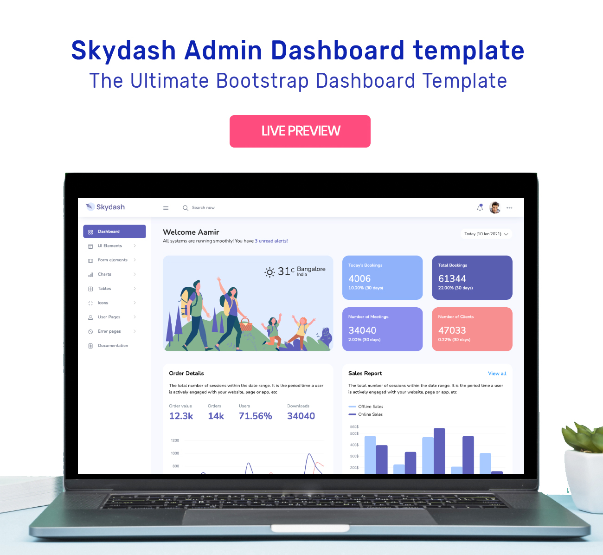

# Skydash - Free Bootstrap Template

Skydash is the latest Bootstrap admin template from BootstrapDash. This template has been meticulously crafted to ensure the best possible experience for developers and users alike. This admin template is super easy to set up, modify and use. The clean design minimizes clutter and improves the overall user experience. Skydash is packed with all the features that fit your needs but not cramped with components you would not even use. It is an excellent fit to build admin panels, e-commerce systems, project management systems, CMS or CRM. It comes with a clean and well-commented code that makes it easy to work with the template. Thus making it an ideal pick for jump-starting your project.

<h1>Demo</h1>
Click below to check out the live demo.

#### Credits:

- Bootstrap 4
  
- Font Awesome
  
- jQuery
  
- Gulp
  
- Chart.js
  
- Google Maps
  
- Perfect Scrollbar

#### Browser Support:

- Chrome (latest)
  
- FireFox (latest)
  
- Safari (latest)

- Opera (latest)

- IE10+

#### License Information:

Skydash is released under MIT license. Skydash is a free Bootstrap 4 admin template developed from BootstrapDash. Feel free to download it, use it, share it, get creative with it.

#### How to use Skydash?

-Install node-gyp package. If you don’t know the installation steps, please click [here](https://github.com/nodejs/node-gyp)

- Click the Clone or Download button in GitHub and download as a ZIP file or you can enter the command git clone https://github.com/BootstrapDash/skydash-free-bootstrap-admin-template.git in your terminal to get a copy of this template.
  
-  After the files have been downloaded you will get a folder with all the required files

-   Open your terminal (Run as Administrator). You can install all the dependencies in the template by running the command npm install. All the required files are in the node modules. If you didn't run with admin authorities, you can see errors.
  
- Find the file named index.html, check what components you need. Open the file in a text editor and you can start editing.

-  Now that your project has now kick-started, all you need to do now is to code, code, and code to your heart's content.

#### How to Contribute?:

We love your contributions and we welcome them wholeheartedly. We believe the more the merrier. To contribute make sure you have Node.js and npm installed. Now run the command gulp --version. If the command returns with the Gulp version number, it means you have Gulp installed. If not you need to run the command npm install --global gulp-cli to install Gulp.

#### Next

After Gulp has been installed, follow the steps below to contribute.

- Fork and clone the repo.
  
- Run the command npm install to install all the dependencies.
  
- Enter the command gulp serve. This will open Skydash in your default browser.
  
- Make your valuable contribution.
  
- Submit a pull request.

### More from BootstrapDash
Here are some of our most popular templates:

- [StarAdmin Free Bootstrap Admin Template](https://github.com/BootstrapDash/StarAdmin-Free-Bootstrap-Admin-Template)
- [PurpleAdmin Free Admin Template](https://github.com/BootstrapDash/PurpleAdmin-Free-Admin-Template)
- [MajesticAdmin Free Bootstrap Admin Template](https://github.com/BootstrapDash/MajesticAdmin-Free-Bootstrap-Admin-Template)
  
### Like what you see?
Please leave a star on our GitHub repo.
Submit bugs and help us improve Corona Angular!
Find us on 
- [Twitter](https://twitter.com/bootstrapdash?lang=en), 
- [Facebook](https://www.facebook.com/bootstrapdash/), 
- [Instagram](https://www.instagram.com/bootstrapdash/?hl=en),
- [Behance](https://www.behance.net/bootstrapdash),
- [Pinterest](https://www.pinterest.com/bootstrapdash/),
- [Dribbble](https://dribbble.com/bootstrapdash),
- [LinkedIn](https://in.linkedin.com/in/bootstrapdash)

#### Go Premium!!

Do you need a template with more features and functionalities? Get more with our collection of premium templates with more plugins, eye-catching animations, UI components, and sample pages all fitting together with a high-quality design. Visit https://www.bootstrapdash.com for more admin templates.

Check out the premium version of [Skydash Bootstrap admin template](https://www.bootstrapdash.com/product/skydash-admin-template/)
